# 📘 Assignment 3: Dynamic Memory Management – README

### *by [Ethan Cann 02592695] and [Ryota Hosokawa 02591705]*


## Table of Contents
1. [Overview](#overview)  
2. [Top-Level Design](#top-level-design)  
   - [allocator.c](#allocatorc)  
   - [freelist.c](#freelistc)  
   - [allocator.h , freelist.h](#allocatorh-freelisth)  
   - [main.c](#mainc)  
3. [Test Version 1 – First-Fit Allocator](#test-version-1) 
4. [Test Version 2 – Best-Fit + Block Merging](#test-version-2)  
5. [Major Problems Encountered and Solutions Test V1 Test V2](#major-problems-encountered-and-solutions-test-v1-test-v2)  
6. [Stress Test - Comparing Fit Strategy + Merging](#stress-testing)
7. [Size Class Arenas - System of Heaps](#size-class-arenas)  
8. [Major Problems Encountered and Solutions Multi Arena](#major-problems-encountered-and-solutions-multi-arena)  
9. [Conclusion](#conclusion)


## **Overview**

This project is a custom **dynamic memory allocator** implemented in C.  
It simulates a simplified version of `malloc()` and `free()` using a manually managed memory region obtained via `mmap()`.

The project was developed in versions, each adding more advanced allocator features:

- **Test Version 1:** Basic first-fit allocation, freeing of allocated memory and block splitting. 
- **Test Version 2:** Best-fit allocation, inserting freed blocks in sorted order + adjacent block merging (coalescing).
- **Stress Test:** Compared the performances of the fit strategies and merging.
- **Multi Size Class Arenas** Created different size heaps to manage different sized memory allocations.

We have fully implemeted each of these 4 sections and tested that it works accurately.


## **Top-Level Design**

The system is built around several C modules, each with a clear responsibility.  
Together they form a minimal but functional memory management subsystem.

### `allocator.c`
This file implements the **allocation utilities**, including:
- `smalloc()` — allocates memory (first-fit in V1; best-fit in V2)
- `sfree()` — frees memory and merges adjacent blocks (V2)
- Memory statistics and debugging used in `main.c`:
    - `allocator_list_dump()`
    - `allocator_free_mem_size()`
    - `allocator_req_mem()`
- It also calls:
    - `get_mem_block()` - mmap wrapper to allocate a heap memory space
    - `freelist.h` - freelist definitions
    - `allocator.h` - allocator defintions

### `freelist.c`
Manages the internal **free list**, which stores unallocated memory blocks.  
Key responsibilities:
- Initialising the free list (`init_free_list`)
- Storing blocks as a linked list of `common_header_t`
- In Test Version 2: inserting blocks in **sorted order** and enabling **coalescing** of adjacent blocks.

### `allocator.h`, `freelist.h`
These define:
- The memory layout structure (`common_header_t`)
- The public function prototypes
- The global free list pointer (`freelist_head`)
- `#define MEM_SIZE` for configurable simulated heap size

The headers enable clean separation of allocator logic and free list management.

### `main.c`
A test driver that:
- Runs a fixed logic pattern of allocations and frees that randomly change the memory space used
- Tracks successful and failed allocations  
- Prints the state of the allocator at the end  

`main.c` was used throughout development to validate correctness, quality of code and debugging.


## **Test Version 1**  
### Intro: *First-Fit Allocation, Splitting, and Basic Freeing*

In Test Version 1, the goal was to create a minimal working allocator that could allocate and deallocate memory correctly without memory leakage.

#### **First-Fit Allocation**
`smalloc()` scanned the free list sequentially and chose the **first sufficiently large block** using the condition:
```c
if ((size_t)cur->size >= n)
```

#### **Block Splitting**
If a free block was larger than needed, it was split into:
- an allocated block
- a new smaller free block

This required careful pointer arithmetic to correctly map to the end of the allocated block:
```c
(base + sizeof(common_header_t) + n)
```

#### **Basic Free**
`sfree()` simply added on the freed block to the head of the free list without the need of ordering or merging:
```c
common_header_t *hdr = (common_header_t*)((uint8_t*)p - sizeof(common_header_t));

hdr->next = freelist_head; 
freelist_head = hdr;
```

### Terminal Output after running `main.c`:

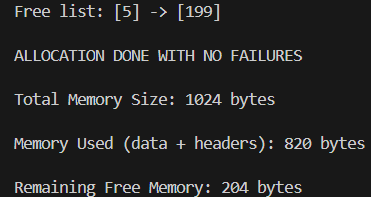

As shown, it runs without problem and successfully allocates the small space of memory accordingly. However, this is only a small test so we will find out a better measure of its performance during the stress test in a more realistic scenario.

## **Test Version 2**
### **Intro: *Best-Fit Allocation, Sorted Insert, and Merging (Coalescing)***

Test Version 2 improved efficiency and reduced fragmentation through smarter block management. We created the free list in order of actual memory location, merged adjacent free blocks and allocated memory in the tightest fitting space. Although this meant that the process would take longer because it would have to scan the entire free list each time, memory allocation was the obvious priority.


#### **Best-Fit Allocation**

Instead of first-fit, the allocator searches the **entire** free list to find the block with the smallest leftover space that can satisfy the request. The cost is higher runtime, but the memory footprint becomes tighter.

```c
common_header_t *best = NULL;
common_header_t *best_prev = NULL;
common_header_t *prev = NULL;
common_header_t *cur = freelist_head;

while (cur != NULL) {
    if (cur->size >= (int)n) {
        if (best == NULL || cur->size < best->size)  {
            best = cur;
            best_prev = prev;
        }
    }
    prev = cur;
    cur = cur->next;
}
```

#### **Sorted Insert of Freed Blocks**

Freed blocks are inserted into the freelist **in ascending address order** rather than just dumping the node at the head each time. This was necessary for reliable merging because two blocks can only be merged if they are both:

1. Consecutive in memory
2. Consecutive in the freelist

This ordering was implemented using a helper function that would map to the free node before the block and reroute the pointers to insert the block into the correct address position:

```c
static common_header_t *insert_sorted_and_return_prev(common_header_t *block) {  
    
    if (freelist_head == NULL || block < freelist_head) { 
        block->next = freelist_head;
        freelist_head = block;
        return NULL; 
    }

    common_header_t *cur = freelist_head;
    while (cur->next != NULL && cur->next < block) {  
        cur = cur->next;
    }

    block->next = cur->next;
    cur->next = block;
    return cur; 
}

```

#### **Merging**

The merging logic was simply to check if the memory address of the two surrounding freelist nodes around the newly freed block overlapped. If so, combine the nodes into one. Hence, we used two helper functions, one to check merge with the next node and one to check merge with the previous node:

```c
static int try_merge_with_next(common_header_t *block) {
    if (block == NULL || block->next == NULL) return 0;

    uint8_t *block_end = (uint8_t*)block + sizeof(common_header_t) + (size_t)block->size;
    if (block_end == (uint8_t*)block->next) { 
        block->size += (int)(sizeof(common_header_t) + (size_t)block->next->size);
        block->next = block->next->next;
        return 1;
    }
    return 0;
}
```
```c
static int try_merge_prev_with_next(common_header_t *prev) {
    if (prev == NULL || prev->next == NULL) return 0;

    uint8_t *prev_end = (uint8_t*)prev + sizeof(common_header_t) + (size_t)prev->size;
    if (prev_end == (uint8_t*)prev->next) {
        prev->size += (int)(sizeof(common_header_t) + (size_t)prev->next->size);
        prev->next = prev->next->next;
        return 1;
    }
    return 0;
}
```

### Terminal Output after running `main.c`:

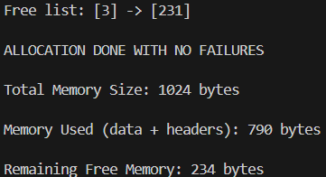

As shown, once again it runs without problem and successfully allocates the small space of memory accordingly. We cannot tell if it is performing better than the first-fit strategy through this testing because each time we run the test, the memory spaces allocated and freed are different. So the results are of course slightly different and don't tell us anything about its memory management capabilities. Therefore once again, this is only a small test so we will find out a better measure of its performance during the stress test in a more realistic scenario.


## **Major Problems Encountered and Solutions Test V1, Test V2**

### Fix 1. Allocator Infinite Loops
**Cause:** When allocating memory, incorrect pointer rewiring during block splitting created a mess. Specifically, we forgot to remove the newly allocated best-fit node from the free list.

**Fix:** Reconstructed the split logic and ensured allocated blocks were fully removed from the freelist after splitting:
```c
if (best_prev == NULL) {
            freelist_head = new_block;
        else {
            best_prev->next = new_block;
        }
}
```

### Fix 2. Incorrect Splitting Condition
**Cause:** When block splitting, hadn't considered the fact that we need to not only consider that there is extra unallocated space but also whether that space is large enough to store a free list node.

**Fix:** Added the size of the free list node to calculate whether we can allocate a free memory block:
```c
if (remainder >= (int)(sizeof(common_header_t) + 1)) 
```

### Fix 3. Incorrect offsetting Arithmetic
**Cause:** Initially had tried to use the **block pointer** `best` to be part of the offset address arithmetic for when we split:
```c
 common_header_t *new_block = (common_header_t*)(best + sizeof(common_header_t) + n);
 ```

**Fix:** Needed to create a **byte pointer** `base` to be able to do the correct arithmetic:
```c
uint8_t *base = (uint8_t*)best;
common_header_t *new_block = (common_header_t*)(base + sizeof(common_header_t) + n);
```

## **Stress Testing**

### **What's New?**
- The new stress test code `c_allocation_stress_test.c` is a dedicated test driver used to measure and evaluate the performance and robustness of our custom memory allocator (smalloc and sfree) under continuous heavy load and fragmentation. It requires for a call on a `void allocator_stats(size_t* N, size_t* F, size_t* L)` function that iterates through the freelist linked list to calculate: 
    1. N -> Total number of freelist nodes
    2. F -> Total amount of free bytes for allocation
    3. L -> The largest free block size

- Predefined global values for the `FIT_STRATEGY` and `MERGE_ENABLED` to be able to set different combinations of cases to test: 
```c
#define FIRST_FIT 1
#define BEST_FIT 2

extern int FIT_STRATEGY;
extern int MERGE_ENABLED;
```

Therefore, to test different cases, we just need to change the values of these global variables within `allocator.c` file.

```c
if (FIT_STRATEGY == BEST_FIT) {  // fit type
    if (best == NULL || cur->size < best->size)  {// if first match or smaller than current best
            best = cur;
            best_prev = prev;
    }
    else if (FIT_STRATEGY == FIRST_FIT) { 
        best = cur;
        best_prev = prev;
        break; // use the first free list node and exit
    }
}
```
```c
if (MERGE_ENABLED) {   // merge toggle
    try_merge_with_next(block);

    if (prev != NULL) { // if the freelist node isn't the head node
        try_merge_prev_with_next(prev);
    }
}
```

### **Expected Performance Comparison Table:**

| Metric | Case 1: First-Fit / No Merge | Case 2: Best-Fit / No Merge | Case 3: Best-Fit / Merge Enabled |
| :--- | :--- | :--- | :--- |
| **Successful Allocations** | **Very Low** | **Low** | **High** |
| **External Fragmentation** | **Very High** $\approx 1.0$ | **High** | **Very Low** $\approx 0.0$ |
| **Bytes-to-Failure Turnover (BTF)** | **Very Low** (Fails very early) | **Low to Medium** | **Very High** |
| **Freelist Length** | **Medium** | **Long** | **Long** |
| **Speed (Runtime)** | **Medium** (First-Fit search is fast, but list is long) | **Very Slow** (Must scan long list fully every time) | **Fast** (Best-Fit scan is slow, but list is short) |

### **Case 1,2,3 Stress Test Outcomes:**

#### **Case 1: First-Fit / No Merge**
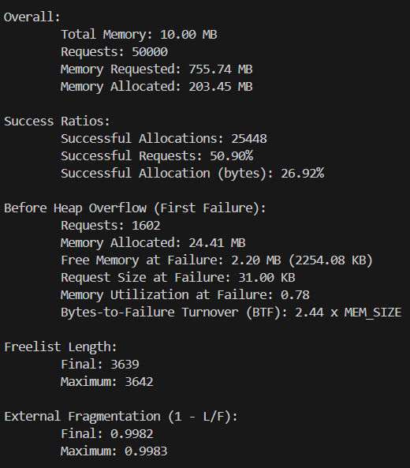

#### **Case 2: Best-Fit / No Merge**
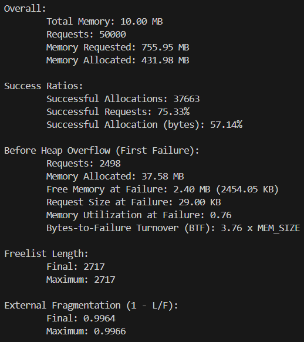

#### **Case 3: Best-Fit / Merge Enabled**
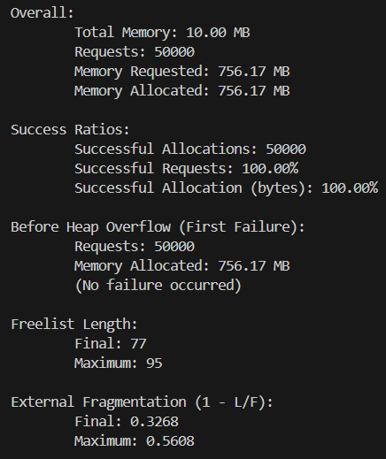


### **Extension: Runtime Results:**

#### **Runtime: Case 1: First-Fit / No Merge**
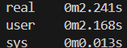

#### **Runtime: Case 2: Best-Fit / No Merge**
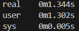

#### **Runtime: Case 3: Best-Fit / Merge Enabled**
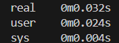

### **Results Analysis**

As shown in our expectations, we had expected these outcomes, however, there were a few results that were quite interesting to consider. For example, Case 3 had **100% success rate** every single time and **almost never ended in failure**. Its freelist length was also shockingly way shorter which was of course because all the adjacent free blocks were combined so could be reused again and again. Furthermore, we didn't have an exact quanity able to test to These results really revealed how the major differences in performance are driven by the implementation of the **Merging (Coalescing)** feature, which dictates how quickly external fragmentation accumulates.

We measured the runtime of the cases using a the shell code `time ./stress_test` which proved our **expectations to be wrong**. Initially, we believed that when first-fit is used runtime would be shorter because it doesn't need to scan through the entire free list each time. However, after looking at the results, we have realised that merging allows our free list to be much shorter which compensates for the fact that we need to scan through the entire list using best-fit strategy.

### **Case 4: The tipping point of failure ( Best-Fit / Merge Enabled )**

#### **MAX_REQ_SIZE = 36KB:**
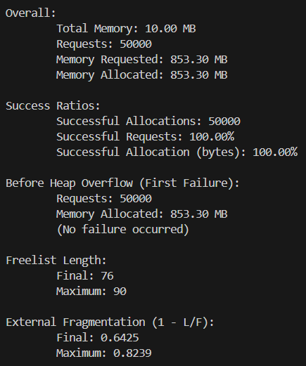

#### **MAX_REQ_SIZE = 37KB:**
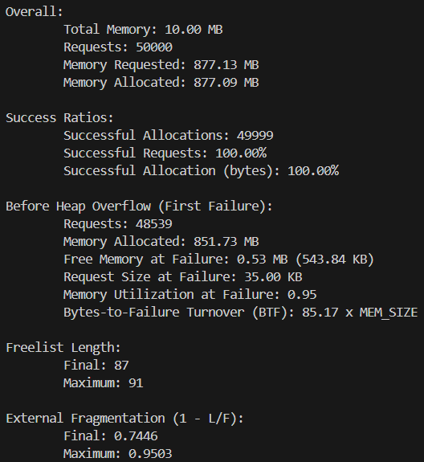

As shown, the memory allocation system failed at a MAX_REQ_SIZE = 37KB and the failure was a result of a 35KB memory request that couldn't be allocated. This seems to be a failure due to external fragmentation because there is still 543.85KB available but was scattered everywhere. This result was still impressive since the BTF was 85 times the size of the memory and shows impressive memory management.

## **Size Class Arenas**

### **Intro: *Size Class Arenas are needed in more Real Applications***
 
In our single-heap Version 2 allocator (Best-Fit + Merging), we saw that even with merging enabled, the allocator eventually failed with high external fragmentation when stressed with a wide variety of request sizes. The reason is that small requests and large requests compete for the same free blocks, which leads to inefficiencies: 
- A large free block gets **split to satisfy a tiny request**, leaving a slightly smaller large block that may not be useful for subsequent large requests.

- The large free list gets **cluttered with both tiny and massive free blocks**, increasing search time.

The solution to this is to isolate the memory blocks by size:
- **TINY** requests are handled by the **TINY Arena**

- **SMALL** requests are handled by the **SMALL Arena**

- **MEDIUM** requests are handled by the **MEDIUM Arena**


### **Specifics to Implementing the Size Class Arena:**

#### 1. Added Three Separate Heaps
Three independent arenas were created for the different sized heaps:

- **Small Arena** ( ≤ 512 Bytes)
- **Medium Arena** ( ≤ 4096 Bytes)
- **Large Arena** (> 4096 Bytes)

Each arena receives its own:
- `mmap`-allocated heap region  
- Independent free list  
- Internal splitting and merging logic  

This required replacing the single `freelist_head` with:

```c
common_header_t *freelist_small;
common_header_t *freelist_med;
common_header_t *freelist_large;
```

#### 2. Added Arena Initialization Logic

A new function init_arenas() was created to allocate each heap using mmap and initialize its free list:

```c
void init_arenas(void) {
    heap_small = get_mem_block(NULL, SMALL_HEAP);
    init_free_list_explicit(&freelist_small, heap_small, SMALL_HEAP);

    heap_med = get_mem_block(NULL, MED_HEAP);
    init_free_list_explicit(&freelist_med, heap_med, MED_HEAP);

    heap_large = get_mem_block(NULL, LARGE_HEAP);
    init_free_list_explicit(&freelist_large, heap_large, LARGE_HEAP);
}
```

#### 3. Added Size-Classification Logic

Allocation requests are now routed based on size:

```c
common_header_t **arena_head_for_size(size_t n) {
    if (n <= SMALL_MAX) return &freelist_small;
    if (n <= MED_MAX)   return &freelist_med;
    return &freelist_large;
}
```

This required modifying smalloc() to operate only on the selected arena. Instead of always using a single free list, the allocator now:

- Determines which arena a block belongs to

- Splits, removes, and inserts into only that arena's free list

- Performs merging inside the correct arena

- A pointer-to-pointer (common_header_t **) was used so that updating the arena head works correctly.

#### 4. Updated Statistics and Debug Functions

To maintain compatibility with the stress test, functions like:

- allocator_stats()

- allocator_free_mem_size()

- allocator_list_dump()

were updated to aggregate across all three arenas. This allowed the stress test to run unchanged while the allocator became multi-arena internally.


## **Major Problems Encountered and Solutions Multi Arena**

### **Unbalanced Arena Sizes Leading to Early Failures**

The first attempt used:
```c
#define SMALL_MAX  256
#define MED_MAX    2*1024   

#define SMALL_HEAP  (2*1024*1024)
#define MED_HEAP    (4*1024*1024)
#define LARGE_HEAP  (4*1024*1024)
```

But the stress test allocates uniformly random sizes up to ~32KB. Most requests are larger than 2KB which is the lower bound for the Large Heap, so nearly all allocations were routed to the Large Arena. This caused:

#### **Failure Before Heap Memory Adjustment:**
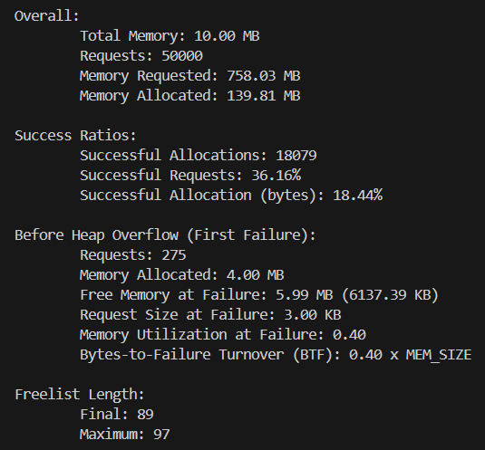

What made us realise that we needed to change either the Heap Boundaries or Heap Memory Capacities is that we noticed that the Memory Allocated had stopped perfectly at 4MB, which was the size of the Large Arena. Therefore this led us to think that the Large ARENA was overloaded with allocation requests and was the point of failure.

**Solution:** We rebalanced the arenas based on request distribution:
```c
#define SMALL_MAX  14*1024   // old: 256 Bytes
#define MED_MAX    25*1024   // old: 2*1024 Bytes

#define SMALL_HEAP  (2*1024*1024)
#define MED_HEAP    (4*1024*1024)
#define LARGE_HEAP  (4*1024*1024)
```

#### **After Heap Memory Adjustment:**
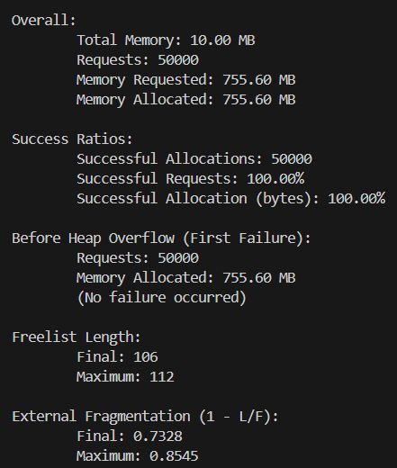


### **Ensuring Freed Blocks Returned to the Correct Arena**

As all arenas are mmap’d back-to-back in separate regions, `sfree()` needed logic to detect which arena a pointer belonged to:

```c
static common_header_t **arena_head_for_ptr(void *ptr) {
    if (ptr == NULL) return &freelist_small; 
    uintptr_t p = (uintptr_t)ptr;

    if (heap_small) {
        uintptr_t start = (uintptr_t)heap_small;
        uintptr_t end = start + SMALL_HEAP;
        if (p >= start && p < end) return &freelist_small;
    }
    if (heap_med) {
        uintptr_t start = (uintptr_t)heap_med;
        uintptr_t end = start + MED_HEAP;
        if (p >= start && p < end) return &freelist_med;
    }
    // default
    return &freelist_large;
}
```
This made sure that we were returning the correct freelist depending on the heap size which were causing significant errors at early testing stages.

Similarily, all helper functions (e.g. `insert_sorted`, `try_merge_with_next`) were updated to take a reference to the correct arena head rather than using a global freelist. Therefore we always passed around `common_header_t **arena_head` to be use as the condition for which heap to work with.


## **Conclusion**

Overall, this was a very fun assignment to make a system of codes that can manage and allocate memory effectively. The process was very interesting to learn about the different methods of allocation such as the most recent example of using multi-size arenas. In future progress, it would be meven more interesting to see how we could implement paging into this and come closer to the most recent methods of memory allocation used in reality today. 

